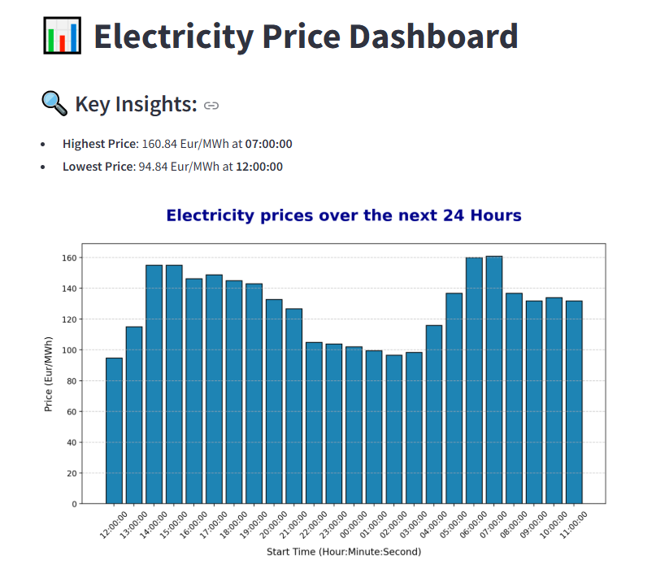

# Electricity Price Dashboard

This project is a Streamlit-based dashboard that visualizes electricity price predictions for the next 24 hours.
It provides key insights such as the highest and lowest prices, displayed alongside a barchart.

## Features
- **Live Data Fetching:** Retrieves real-time electricity prices for the next 24 hours  from the [aWATTar API]( <https://www.awattar.com/>). 

- **Data Processing:** Converts raw data into a human-readable format.

- **Visualization:** Displays prices using a barchart with clear labels, gridlines and key insights.

## Requirements
- Python 3.8+
- Streamlit
- pandas
- requests
- matplotlib

## Installation
1. *Clone this repository*:
   ```bash
   git clone  https://github.com/ahmedkhliaa/dashboard_project.git

2. *Navigate to the project directory*:   
    ```bash
   cd electricity-price-dashboard

3. *Create and activate a virtual environment*:
    ```bash
   python -m venv venv

    #On Windows:
   venv\Scripts\activate

   #On Mac/Linux:
   source venv/bin/activate

4. *Install dependencies*:
    ```bash
   pip install -r requirements.txt
   
## Usage 
1. *Run the Streamlit app*:
   ```bash
   streamlit run app.py
2. *Open the URL provided in your terminal to view the dashboard*

## Screenshot
Here is a preview of the dashboard:


   


